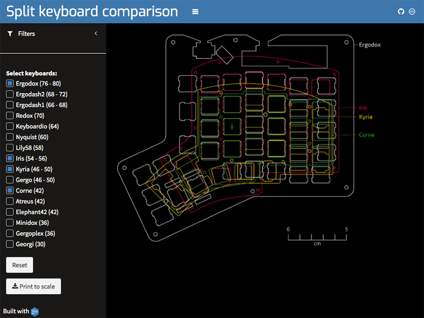

# splitKbCompare

Interactive [tool](https://jhelvy.shinyapps.io/splitkbcompare/) for comparing layouts of different split mechanical keyboards.

Supported keyboards (in order of number of keys):

- [ErgoDox](https://github.com/Ergodox-io/ErgoDox)
- [ErgoDash](https://github.com/omkbd/ErgoDash)
- [Redox](https://github.com/mattdibi/redox-keyboard)
- [Lily58](https://github.com/kata0510/Lily58)
- [Iris](https://github.com/keebio/iris-case)
- [Kyria](https://github.com/splitkb/kyria)
- [Corne](https://github.com/foostan/crkbd)
- [Minidox](https://github.com/dotdash32/Cases/tree/master/Minidox)

Colors are from the [Dark2](http://colorbrewer2.org/#type=qualitative&scheme=Dark2&n=8) color palette from colorbrewer

Screenshot:

